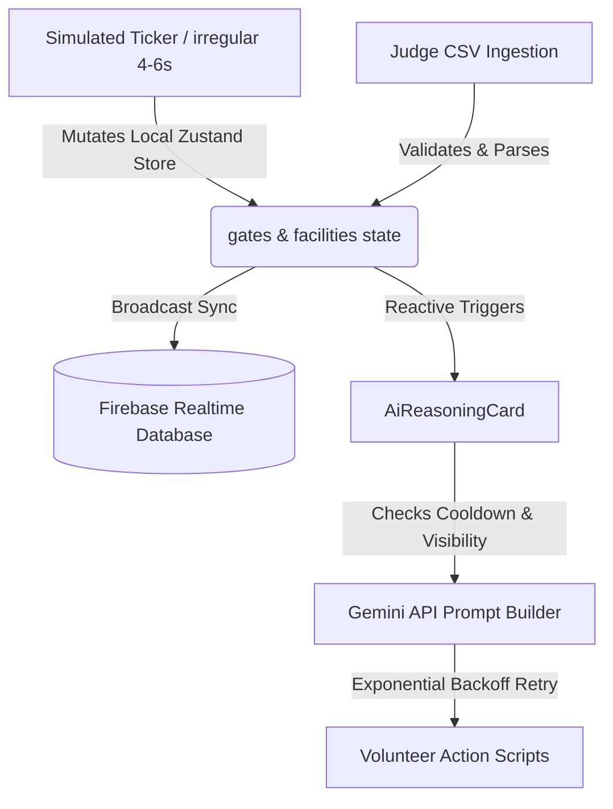

# FlowOps AI

**FlowOps AI** is a **dynamic assistant** built for the **FIFA World Cup 2026**. It provides **real-time decision support** and **logical decision making** capabilities to stadium volunteers handling **crowd management** at high-density venues.

## Problem Statement & Persona
We chose the **Volunteer** persona operating in the **Crowd Management** vertical.

During major events like the FIFA World Cup, volunteers are the frontline for crowd safety. They often lack real-time visibility into stadium bottlenecks and struggle with language barriers when helping international fans. FlowOps AI solves this by acting as a smart, real-time co-pilot that synthesizes raw turnstile data into actionable redirection strategies and translates fan requests instantly.

---

## 2. Approach and Logic

### Explainable AI (XAI) Reasoning
Rather than simply displaying raw density numbers, FlowOps AI utilizes Generative AI (Gemini) to perform reasoning over concourse status. The model evaluates gates that cross the safety capacity threshold ($80\%+$), explains *why* the congestion is a concern in plain English (incorporating section weights and inflow directions), and generates specific volunteer actions (such as deploying personnel to concourse junctions) alongside alternative under-capacity routing suggestions. 

### Multi-Tab Concurrency Architecture
To prevent concurrent overwrite conflicts ("last-write-wins" loops) when judges or multiple evaluators open the application in different browser tabs or devices simultaneously:
- The simulated crowd ticker runs **strictly client-side**. This keeps the visual map hotspots alive and dynamic for a single user without polluting the database.
- Ticker mutations do **not** write to the Firebase Realtime Database.
- Database syncs are triggered **only** when a manual CSV Judge Override is uploaded or when the simulator is Reset, acting as a clean state-broadcast mechanism for judge-injected configurations.

### Judge's Override CSV
The CSV import feature allows judges to inject custom stadium layouts, capacity distributions, and wait times. This bypasses the simulator feed entirely, enabling the evaluation of specific gate safety alerts, SVG hotspot colors, and Gemini recommendations under custom stress-test scenarios.

---

## 3. How It Works



1. **Simulated Crowd Ticker**: A background timer fires every 4–6 seconds (irregular intervals for an organic feel) applying bounded random deltas ($[-5, +8]$) to select gates, capping capacity between $0\%$ and $100\%$ and updating trend statistics.
2. **Gemini-powered Recommendation Card**: Evaluates the live gate state. It triggers a fetch on initial mount, on a periodic jittered refresh cycle (15–20s), or immediately when a gate crosses into a critical state.
3. **Alt-Tab Visibility Cooldown**: A 10-second cooldown guard is active when tab visibility switches from hidden to visible, preventing API request storms if a user rapidly alt-tabs away and back.
4. **Firebase Realtime Database Sync**: Connects to the database and keeps the `/crowdState` path updated exclusively on manual overrides and simulator resets.
5. **CSV Ingestion & Validation**: Parses CSV uploads (supporting headers in both camelCase and snake_case), validates boundaries, and automatically maps row values to spatial coordinates (`mapX`, `mapY`) on the SVG stadium layout.
6. **Context-Aware Multilingual Assistant**: A dedicated Translator module allowing volunteers to input fan requests. It parses the text, translates it clearly, and classifies the urgency into actionable tags (e.g., Medical Emergency vs General Request) to help volunteers prioritize responses.

---

## 4. Assumptions Made

* **Synthetic Stadium Feed**: In the absence of live IoT sensor grids or ticketing APIs, the Concourses and Gates utilize simulated synthetic data streams.
* **No User Authentication**: Access control is omitted as this dashboard functions as a single-purpose, high-availability operations board.
* **Firebase Free Tier Constraints**: To prevent exceeding write quotas, data writes are restricted to manual overrides and simulator resets rather than streaming continuous ticker updates.
* **Gemini Free Tier Rate Limits**: Rate limiting (429 errors) is managed by an Exponential Backoff retry handler (retrying once at 1.5s, then at 4.0s, before falling back gracefully to a baseline recommendation).

---

## 5. Tech Stack

* **Core**: React 19, TypeScript, Vite
* **Styling**: Vanilla CSS, Tailwind CSS (Vite plugin configuration)
* **State Management**: Zustand
* **Database**: Firebase Realtime Database
* **AI Platform**: Gemini Developer API (Cognitive reasoning layer)
* **Icons & Visuals**: Lucide React, SVG Stadium Map layout

---

## 6. Live Demo
The application is deployed and publicly accessible at:
👉 **[https://flowops-ai-2026.web.app](https://flowops-ai-2026.web.app)**

---

## 7. Local Setup Instructions

### 1. Clone the Repository
```bash
git clone https://github.com/adarsh52581/FlowOps-AI.git
cd FlowOps-AI
```

### 2. Install Dependencies
```bash
npm install
```

### 3. Configure Environment Variables
Create a `.env` file in the root directory (based on `.env.example`) and fill in your Gemini and Firebase configurations:
```env
# Gemini API
VITE_GEMINI_API_KEY=your_gemini_api_key_here

# Firebase Configuration
VITE_FIREBASE_PROJECT_ID=your_firebase_project_id
VITE_FIREBASE_DATABASE_URL=your_firebase_database_url
VITE_FIREBASE_API_KEY=your_firebase_api_key
VITE_FIREBASE_AUTH_DOMAIN=your_firebase_auth_domain
VITE_FIREBASE_STORAGE_BUCKET=your_firebase_storage_bucket
VITE_FIREBASE_APP_ID=your_firebase_app_id
VITE_FIREBASE_MESSAGING_SENDER_ID=your_firebase_messaging_sender_id
VITE_FIREBASE_MEASUREMENT_ID=your_firebase_measurement_id
```

### 4. Run Development Server
```bash
npm run dev
```
Open `http://localhost:5173` in your browser.

### 5. Run Automated Test Suite
To run all 44 unit and JSDOM integration tests:
```bash
npm test
```

---

## 8. Architecture Documentation
For complete technical plans, specifications, and walkthrough details, refer to:
* **[project-docs/ARCHITECTURE.md](project-docs/ARCHITECTURE.md)** — detailed system data flow, O(1) structures, and Firebase connection rules.
* **[project-docs/PROJECT_CONTEXT.md](project-docs/PROJECT_CONTEXT.md)** — original project challenge parameters and requirements.
